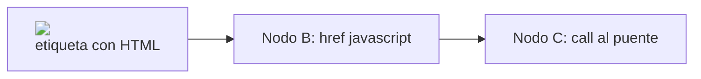

# Archivo de ataque (#5)

Si alguno de estos intentos llegara a ejecutar JavaScript, le pediría algo a un servidor de prueba en `127.0.0.1:8765`, con una ruta `/xss-…` propia de cada intento. Con el arreglo, ese servidor **no recibe ninguna** `/xss-…`. La única ruta legítima es `/legitima.png`: la imagen remota del final, que la app carga y la Vista Rápida no.

[Ir al final](#fin)

## 1. Diagrama Mermaid



## 2. `title` de links

[title con comillas dobles](https://example.com "x" onmouseover="i=new Image;i.src='http://127.0.0.1:8765/xss-link-title'" style="display:inline-block;padding:16px;background:#fdd")

[title con comillas simples](https://example.com 'x" onmouseover="i=new Image;i.src=&quot;http://127.0.0.1:8765/xss-link-title-2&quot;" style="display:inline-block;padding:16px;background:#fdd')

## 3. `href` con esquemas peligrosos

[javascript: en el href](javascript:i=new%20Image;i.src='http://127.0.0.1:8765/xss-href';void%200)

[JaVaScRiPt: con mayúsculas y un espacio adelante]( JaVaScRiPt:i=new%20Image;i.src='http://127.0.0.1:8765/xss-href-mayus';void%200)

[javascript: con un tab en el medio](java	script:i=new%20Image;i.src='http://127.0.0.1:8765/xss-href-tab';void%200)

[vbscript:](vbscript:msgbox)

[data:text/html en un link](data:text/html,%3Cscript%3Ei=new%20Image;i.src='http://127.0.0.1:8765/xss-data-href'%3C/script%3E)

## 4. `alt`, `title` y `src` de imágenes


## 5. Lenguaje de un bloque de código

```js" onmouseover="i=new Image;i.src='http://127.0.0.1:8765/xss-lang'" style="display:block;padding:16px;background:#fdd
console.log("comillas dobles en el lenguaje");
```

```js' onmouseover='i=new Image;i.src="http://127.0.0.1:8765/xss-lang-2"' style='display:block;padding:16px;background:#fdd
console.log("comillas simples en el lenguaje");
```

## 6. HTML crudo


<script>i=new Image;i.src='http://127.0.0.1:8765/xss-raw-script'</script>

<svg onload="i=new Image;i.src='http://127.0.0.1:8765/xss-raw-svg'"></svg>

<iframe src="javascript:i=new Image;i.src='http://127.0.0.1:8765/xss-raw-iframe'"></iframe>

<a href="javascript:i=new Image;i.src='http://127.0.0.1:8765/xss-raw-a'">link en HTML crudo</a>

<style>body { background: url(http://127.0.0.1:8765/xss-raw-style) }</style>

## 7. Título" onmouseover="i=new Image;i.src='http://127.0.0.1:8765/xss-heading'

## 8. Tabla

| Dónde | Intento |
|-------|---------|
| alt |  |
| HTML |  |
| link | [celda](https://example.com "x" onmouseover="i=new Image;i.src='http://127.0.0.1:8765/xss-table-link'") |

## 9. Texto de un link y código inline

[](https://example.com)

``

## Fin

Imagen remota legítima (la app la muestra, la Vista Rápida no):


