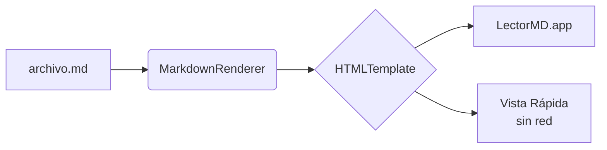

# Documento normal

Un documento sin trucos, para ver que el arreglo del #5 no cambia nada visible. Texto con **negrita**, _cursiva_, ~~tachado~~, `código inline` y comillas "dobles" y 'simples' & ampersands < > sueltos.

- [Ir a la tabla](#tabla)
- [Link externo con title](https://example.com/una_ruta_con_guiones_bajos "Un title con comillas")
- [](https://example.com/?a=1&b=2)

## Diagrama



## Código

```swift
func saludo(_ nombre: String) -> String {
    return "Hola, \(nombre)! <3 & chau"
}
```

## Tabla

| Elemento   | Soporte | Nota                 |
|------------|---------|----------------------|
| Headings   | ✓       | con `id` para anclas |
| Tablas     | ✓       | **negrita** en celda |
| Task lists | ✓       | [link](#fin)         |

- [x] Compilar sin Xcode
- [ ] Algo pendiente

> Una cita de bloque con _énfasis_.

## Imagen remota


## Fin

Última línea.
